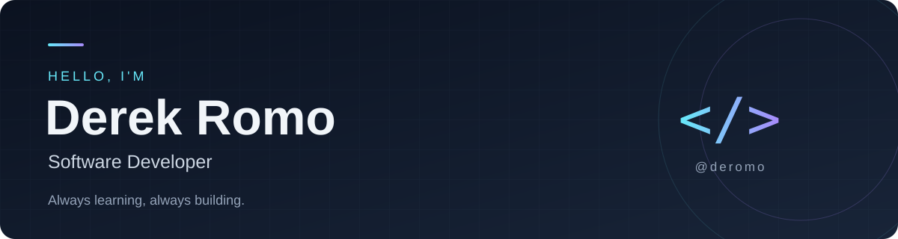

<b>Computer Systems Engineering student at Instituto Tecnológico de la Laguna</b> 
Torreón, Mexico 🇲🇽

---

<table>
<tr>
<td width="65%" valign="top">

## 👋 About me

Hi, I'm Derek! I'm a software developer and Computer Systems Engineering student who enjoys turning everyday problems into useful applications.

I work mainly with **C# and .NET**, building software for the healthcare sector. I've also collaborated on **ARMON-IA / EUCLID**, an AI wellbeing project, contributing to its biometrics backend.

### 🌱 What I'm up to

- 🏥 Developing hospital applications at **Sanatorio Español de Torreón**.
- 🎓 Studying Computer Systems Engineering at **Tec de la Laguna**.
- 🛠️ Building with .NET and working with Python and AI tools through projects.

</td>
<td width="35%" valign="top">

## 📬 Let's connect

**Based in**  
Torreón, Mexico

</td>
</tr>
</table>

## 💼 A little about my work

I've helped bring **three hospital systems into production**, making daily work easier for staff—from shift handovers and prescriptions to real-time maternity announcements.

Most of that work belongs to my employer, so those projects stay private. Here you'll find my public projects and the things I'm learning along the way.

## 💻 Tech stack

<table>
<tr>
<td width="50%" valign="top">

### Languages

### Backend

</td>
<td width="50%" valign="top">

### Databases

### Tools & AI

</td>
</tr>
</table>

## 🛠️ Something I've built

### [Notebooks](https://github.com/deromo/Notebooks)

A browser tool to combine exported notebooks or PDFs into a single document.

---

Thanks for stopping by ✨
